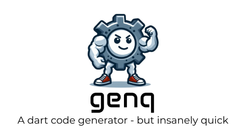
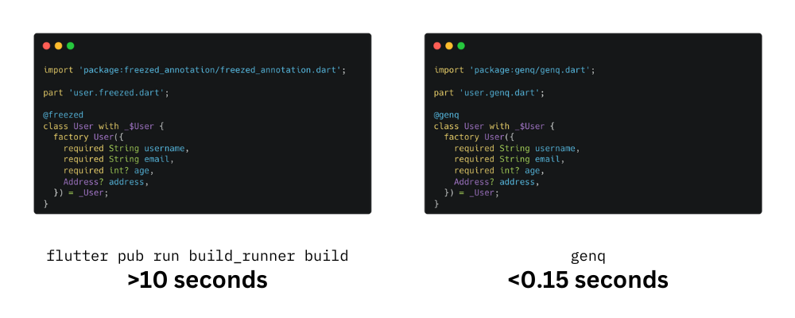
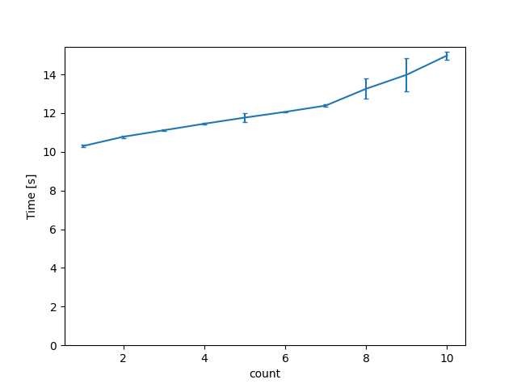
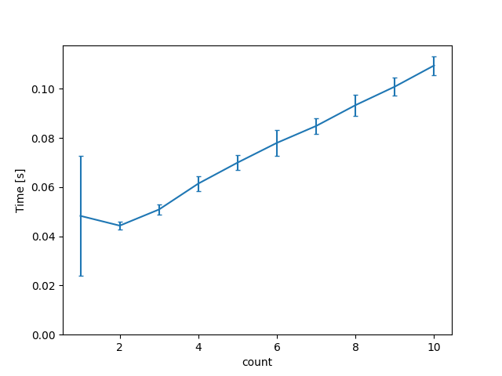

# genq: Instant Data Class Generation for Dart

[](https://github.com/jankuss/genq/actions/workflows/go.yml)
[](https://pub.dev/packages/genq)



# Motivation

With dart, creating data classes can be tedious. You have the choice between:

- Writing them by hand, which is error-prone and time-consuming.
- Using code generation tools like `build_runner` with `freezed`, which become slow for large projects.

genq cuts through the wait and generates data classes for your Dart projects in milliseconds, not minutes. ⚡️

Inspired by **freezed**, genq offers a familiar syntax for defining data classes, 
but with a focus on **lightning-fast performance**. 



# Index

- [Motivation](#motivation)
- [Index](#index)
- [Benchmarks](#benchmarks)
- [Getting Started](#getting-started)
  - [1. Install](#1-install)
  - [2. Add `genq` to your project](#2-add-genq-to-your-project)
  - [3. Define your data classes](#3-define-your-data-classes)
  - [4. Generate the code](#4-generate-the-code)
- [Defining Data Classes](#defining-data-classes)
  - [Overview](#overview)
  - [JSON Serialization/Deserialization](#json-serializationdeserialization)
    - [Customize JSON Serialization](#customize-json-serialization)
      - [Custom fromJson and toJson functions](#custom-fromjson-and-tojson-functions)
      - [Unknowns enum values](#unknowns-enum-values)
    - [Enums](#enums)
    - [Notes](#notes)
  - [How?](#how)
    - [Notes on the subset parser](#notes-on-the-subset-parser)
  - [When should I use `genq` over `build_runner`?](#when-should-i-use-genq-over-build_runner)
  - [Future Plans](#future-plans)

# Benchmarks

`build_runner` + `freezed` 🐌 | `genq` 🚀
:-------------------------:|:-------------------------:
 | 

In this benchmark (located in `./benchmarks`), _count_ is the number of files in the benchmark, containing 250 annotated classes each. So for example, _count=1_ means 250 classes, _count=2_ means 500 classes, and so on. For count 10, `build_runner` and `freezed` took around 46 seconds, while `genq` took 0.11 seconds. **This is a >400x speedup!**

#### Notes

1. Never trust a benchmark you didn't falsify yourself.
2. genq is optimized to perform one task and one task only - data class generation, whereas build_runner is built to do a lot more. Take this into account when choosing between the two.

## Getting Started

### 1. Install

Install genq via brew using the following command:

```
brew install jankuss/genq/genq
```

Or download the latest release from the [releases page](https://github.com/jankuss/genq/releases).

### 2. Add `genq` to your project

```
dependencies:
  # ... Other dependencies ...
  genq: ^0.2.0
```

### 3. Define your data classes

```dart
import 'package:genq/genq.dart';

part 'user.genq.dart';

@genq
class User with _$User {
  factory User({
    required String name,
    required int age,
  }) = _User;
}
```

Read more about defining your data classes [here](#defining-data-classes).

### 4. Generate the code

Run the genq command in your project directory, and you will have your desired data classes generated in no time:

```
genq
```

# Defining Data Classes

## Overview

To define a data class, you need to annotate the class with `@genq` and provide a factory constructor with named parameters.

```dart
import 'package:genq/genq.dart'; // <- Import genq

part 'user.genq.dart'; // <- Add a part directive to the generated file

@genq // <- Annotate the class with @genq
class User with _$User { // <- Add the mixin _$<ClassName>
  factory User({ // <- Define a factory constructor
    required String name, // <- Define fields as named parameters
    required int age,
  }) = _User; // <- Redirecting constructor, _<ClassName>
}
```

The generated class will have the following methods:
- `copyWith`: Create a copy of the data class with modified fields.
- `toString`: Generate a human-readable string representation of the data class.
- `==`: Compare two data classes for equality.

## JSON Serialization/Deserialization

To generate JSON serialization/deserialization code, you need to use the `@Genq(json: true)` annotation instead of `@genq`. 

```dart
import 'package:genq/genq.dart';

part 'user.genq.dart';

@Genq(json: true)
class User with _$User {
  factory User({
    @JsonKey(name: 'full_name')
    required String name,
    required int age,
  }) = _User;
}
```

This will generate two public functions, which you can use to serialize/deserialize the data class to/from JSON:

```dart
$UserFromJson(Map<String, dynamic> json) => /* ... */;
$UserToJson(User value) => /* ... */;
```

### Customize JSON Serialization

You can customize the generated JSON serialization/deserialization code for fields using the `@JsonKey` annotation. 

```dart
import 'package:genq/genq.dart';

part 'user.genq.dart';

@Genq(json: true)
class User with _$User {
  factory User({
    // Customizing the JSON key for the field 'name'. When deserializing, the value of 'full_name' will be assigned to the 'name' field.
    @JsonKey(name: 'full_name')
    required String name,
    // Providing a default value for the field 'age'. If the field is not present in the JSON, the default value will be used.
    @JsonKey(defaultValue: 99)
    required int age,
  }) = _User;
}
```

#### Custom fromJson and toJson functions

You can also provide custom `fromJson` and `toJson` functions for a field using the `fromJson` and `toJson` parameters of the `@JsonKey` annotation.

```dart
import 'package:genq/genq.dart';

part 'user.genq.dart';

class UserName {
  final String value;

  UserName(this.value);

  static UserName fromJson(String value) {
    return UserName(value);
  }

  static UserName toJson(Custom value) {
    return value.value;
  }
}

@Genq(json: true)
class User with _$User {
  factory User({
    @JsonKey(
      fromJson: UserName.fromJson,
      toJson: UserName.toJson,
    )
    required UserName name,
    required int age,
  }) = _User;
}
```

#### Unknowns enum values

You can provide a value for unknown enum values using the `unknownEnumValue` parameter of the `@JsonKey` annotation.
When deserializing and encountering an unknown value, the `unknownEnumValue` will be used instead of throwing an exception.

```dart
import 'package:genq/genq.dart';

part 'user.genq.dart';

@GenqJsonEnum()
enum Role {
  admin,
  user,
  unknown,
}

@Genq(json: true)
class User with _$User {
  factory User({
    @JsonKey(unknownEnumValue: Role.unknown)
    required Role role,
  }) = _User;
}
```

### Enums

Enums are also supported for JSON serialization/deserialization. They need to be annotated with `@GenqJsonEnum`.

```dart
import 'package:genq/genq.dart';

part 'user.genq.dart';

@GenqJsonEnum()
enum Role {
  // You can annotate the enum values with @JsonValue to customize the JSON serialization/deserialization.
  // For example, the string 'ADMIN' will get deserialized to the Role.admin value and vice versa.
  // If you don't provide a value for @JsonValue, the enum value will be serialized/deserialized as a string.
  @JsonValue('ADMIN')
  admin,
  @JsonValue('USER')
  user,
}

```

Similary to the @Genq(json: true) annotation, this will generate two public functions, which you can use to serialize/deserialize the enum to/from JSON:

```dart
$RoleFromJson(Object json) => /* ... */;
$RoleToJson(Role value) => /* ... */;
```

### Notes

The fundamental idea behind the JSON codegen for it to be fast and efficient is to **publicly** expose the generated functions. Based on this, genq can assume for a type
`T` that the functions `$TFromJson` and `$TToJson` are available, thus avoiding unnecessary traversal of other files.

## How?

genq uses its own subset parser of the dart language and generates code directly from the parsed AST. This allows genq to generate code much faster than `build_runner`, which uses the `analyzer` package. Code generation is also done in parallel for each file, which further speeds up the process.

### Notes on the subset parser

The subset parser is written for the specific structures of data classes as defined [here](#defining-data-classes). Thus, there may be parsing errors if the code does not follow the expected structure. While the parser is generally robust when encountering unparsable code, there may be cases where it fails to parse the code correctly. If you encounter such a case, please open an [issue](https://github.com/jankuss/genq/issues/new) with the code that caused the error.

## When should I use `genq` over `build_runner`?

One great thing: you don't have to choose! You can use both in your project. A good guidline would be: Use `genq` for data class generation in your day-to-day development, and `build_runner` for more complex code generation tasks.

If your project is sufficiently small, you might not even need `genq`. However, if you find yourself or your team spending a lot of time waiting for `build_runner` to generate code, `genq` might be a good alternative.

## Future Plans

- [ ] Editor support (VSCode, IntelliJ)
- [ ] Extensibility
